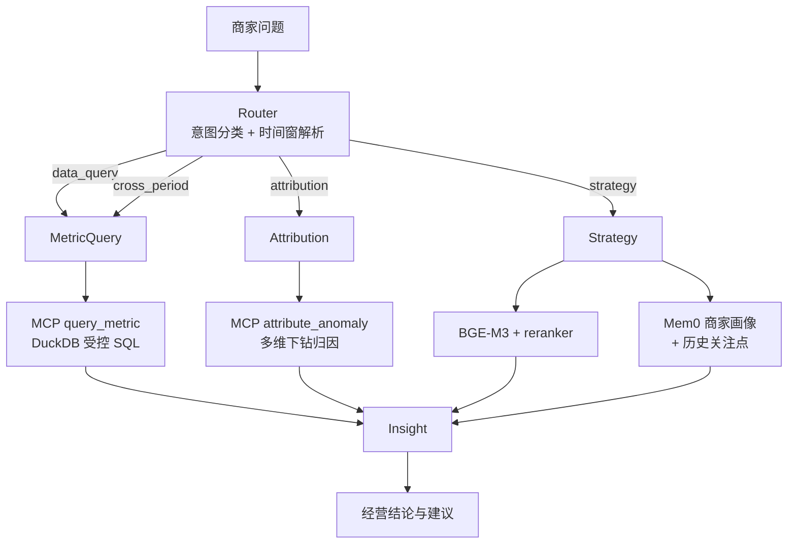

# MerchantCopilot

面向直播电商中小商家的经营分析 Agent：把“发生了什么”推进到“为什么发生、接下来怎么调”。

## 商家可以拿它做什么

| 商家问题 | Agent 给出的结果 | 对应能力 |
|---|---|---|
| “这周 GMV 为什么掉了？” | 拆解流量、转化、商品和退款等维度，定位异常根因并给出证据 | `attribution` |
| “接下来选品、排播、投流该怎么调？” | 结合行业知识、商家画像和历史关注点，给出明确的经营动作 | `strategy` |
| “两个周期的表现有什么变化？” | 按多个时间段计算并比较指标，处理完整月与部分月的口径差异 | `cross_period` |
| “昨天 GMV、转化率、退款率是多少？” | 将自然语言请求转成受控 OLAP 查询，返回结构化指标 | `data_query` |

MerchantCopilot 不是被动的数据展示或通用问答工具。`strategy` 节点会基于商家画像、RAG 证据和当前问题，给出有倾向性的经营判断：优先做什么、减少什么、不同场次如何分配，而不是只罗列中性事实让商家自己判断。

---

## 最值得看的三组结果

### 1. 从 46,735 ms 降到 7,513 ms：一次可复现的延迟诊断

RAG 首版把 BGE-M3 和 bge-reranker-v2-m3 同时放在 MPS 上，稳态单次检索耗时达到 46,735 ms。分阶段探针确认：`reranker.predict` 会驱逐 embedder 的 MPS shape cache，两套模型在同一设备共存形成了反复失效与重编译链路。

最终只把 reranker 移到 CPU，embedder 继续使用 MPS：

| 指标 | 双模型同驻 MPS | MPS + CPU 隔离 | 改善 |
|---|---:|---:|---:|
| Embedding | 约 21,000 ms | 约 780 ms | 27× |
| Rerank | 约 25,000 ms | 约 6,700 ms | 3.7× |
| 检索总延迟 | 46,735 ms | 7,513 ms | 6.2× |

这不是通过换小模型换来的数字，而是先定位缓存驱逐根因，再用设备隔离切断资源争抢链路。阶段 5 的 LangSmith trace 进一步确认：稳态 `rag_rerank` 为 7,133 ms，占 `rag_retrieve` 7,942 ms 的 90%。

完整诊断链见 [`docs/stage4a_summary.md`](docs/stage4a_summary.md)。

### 2. Memory 的价值经过消融验证，不靠主观样例证明

在 50 条 strategy 查询上对比“开启 Memory”和“关闭 Mem0、保留 RAG”，人工按预注册规则判断画像锚定：

| 度量 | 关闭 Memory | 开启 Memory | McNemar χ²（连续校正） |
|---|---:|---:|---:|
| Mem0 独有聚合事实锚定 | 0% | 40% | 20.0（18.05） |
| 常驻画像宽锚定 | 66% | 82% | 8.0（6.12） |
| 时序记忆锚定（n=16） | 0/16 | 12/16 | 12.0（10.08） |

> 注：“开启 Memory”对应原始报告 [`evals/runs/ablation_6_3_report.md`](evals/runs/ablation_6_3_report.md) 的 `full` 组，“关闭 Memory”对应 `-Mem0` 消融组。数值与原始报告一致，仅调整了列顺序，以匹配“关闭→开启”的叙事方向。

最有区分度的是第一项：知识库和通用模型都没有“主力客群合计约 85%”这一商家聚合事实。关闭 Memory 后，该事实的锚定率严格归零；开启 Memory 后为 40%。

实验也暴露了诚实边界：价格带、客群和主播分工已经出现在商家专属知识库里，因此 Mem0 与 RAG 在基础画像上存在冗余。Memory 真正不可替代的贡献集中在知识库之外的聚合事实和跨轮时序记忆，而不是所有策略内容。

完整报告见 [`evals/runs/ablation_6_3_report.md`](evals/runs/ablation_6_3_report.md)。

### 3. 评测形成了从消融到 bad case 回流的闭环

项目建立了 80 条版本化评测集，覆盖指标查询、异常归因、策略建议和跨周期对比。被测 Agent 使用 DeepSeek-V3，judge 使用经过校准的 Qwen-Max，通过跨厂商评审降低同模型自评偏差。消融结果证明 Memory 对商家画像锚定的提升具有统计显著性。评测暴露的 bad case 经修复后通过率从 0% 提升到 70%，同时保持 16/16 契约测试通过；完整评测方法论见下文“评测设计”。

---

## 系统如何工作



LangGraph 使用 `StateGraph` 编排五个节点。Router 将请求一次性路由到 MetricQuery、Attribution 或 Strategy；三条路径最终汇入 Insight。

指标和归因 SQL 全部下沉到一个 MCP Server，Agent 节点只负责理解意图和组织结果。RAG 与 Mem0 只由 Strategy 消费，避免把检索和画像能力无差别塞进所有任务。

---

## 技术栈

| 层 | 技术 | 在项目中的作用 |
|---|---|---|
| Agent 编排 | LangGraph 1.2.0 / StateGraph | Router、三类任务节点、Insight 汇总与条件边 |
| 主模型 | DeepSeek-V3 API | Router 分类、策略生成和自然语言综合 |
| 备用与评测模型 | Qwen-Max API | Agent provider 备用；跨厂商 LLM-as-judge |
| 商家记忆 | Mem0 2.0.2 + Chroma 1.5.9 | 确定性画像写入、聚合事实和历史关注点 |
| RAG | BGE-M3 + bge-reranker-v2-m3 / sentence-transformers 5.5.0 | Dense 召回后重排，向 Strategy 提供业务知识 |
| 工具协议 | Python MCP SDK 1.27.1 / stdio | 一个 Server 暴露 `query_metric`、`attribute_anomaly` 两个工具 |
| 结构化分析 | DuckDB 1.5.2 | 四张表上的本地 OLAP 和归因 SQL |
| 可观测性 | LangSmith 0.8.5 | 12 处显式 `@traceable`，覆盖节点、LLM、RAG 和 Memory |
| Demo UI | Streamlit 1.57.0 | 展示最终回答、知识库召回、商家画像、建议和 trace 链接 |
| 测试与评测 | pytest 9.0.3 + 自建 eval pipeline | 16 条契约测试、judge 校准、消融和 bad case 回归 |

---

## 关于 demo 和合成数据

这是一个面试与简历展示项目，不假装自己是已经接入真实店铺、可以直接上线的 SaaS 产品。

没有接真实直播电商数据，首先是现实边界：抖音电商和快手开放平台的商家数据接入要求企业或个体工商户资质，并依赖实际经营店铺；淘宝开放平台虽然允许个人注册，但没有开放直播维度数据。让面试 demo 依赖这些资质和经营条件没有实际意义。

更重要的是，归因测试需要提前知道正确答案。要验证 Agent 能不能识别“GMV 下跌是人货错配，而不是流量减少”，评测者必须知道这次异常真正是怎么发生的。项目因此使用固定随机种子生成 90 天经营数据，并主动植入 3 个已知业务异常。这样每条归因链都有可核验的 ground truth；真实数据如果没有独立验证渠道，反而无法精确判断 Agent 的根因结论是否正确。

所以，受控合成数据不是“拿不到真实数据只能将就”，而是为了让异常归因能力真正可测试、可复现而做的主动选择。

当前虚拟商家为“小张女装”：

- 类目：中端女装，主力价格带 ¥100–300。
- 主力客群：18–24 岁学生与 25–30 岁职场新人。
- 数据窗口：2026-02-17 至 2026-05-17，共 90 天。
- 数据规模：14,183 笔订单、60 个 SKU、154 场直播、360 条流量来源记录。
- 数据生成：固定随机种子 42，重复运行会 DROP 后重建相同结果。

数据口径、四张表 schema 和三个异常 case 见 [`data/README.md`](data/README.md)。

---

## 评测设计

80 条 `eval-dataset-v1.1` 由基础集和四轮扩展组成：

| 组成 | 条数 |
|---|---:|
| v1.0 基础集 | 20 |
| v1.1 Round 1 | 14 |
| v1.1 Round 2 | 22 |
| v1.1 Round 3 | 13 |
| v1.1 Round 4 | 11 |
| 合计 | 80 |

评测流程不是直接相信 judge 输出：

1. 先从版本化数据集中分层抽样，覆盖四类查询、不同难度和已知 hard case。
2. 用人工标注校准 Qwen-Max judge。
3. 每条回答采样 3 次并取众数，降低单次 LLM 波动。
4. binary 查询达到 α=0.856 后才进入显著性检验。
5. strategy 连续值只有 Spearman 0.605，因此明确限制其用途。
6. 消融使用配对设计，比较 `full / -Mem0 / 裸 LLM`。
7. bad case 修复后同时重跑目标样本和 16 条既有契约测试。

系统与裸 LLM 的自动 judge 原样结果为 26.7% 对 6.7%，χ²=3.6、连续校正 2.5，未达到显著线。人工核查发现裸 LLM 的两个“通过”都是 judge 将编造或假设数字误判为正确；纠正这两个假阳后，结果为 26.7% 对 0%，χ²=8.0。

这里同时得到两个结论：接入结构化数据的系统比无数据访问能力的裸 LLM 更可靠；经过校准的 LLM-as-judge 也只在其校准分布内可信。

校准和消融细节见：

- [`evals/runs/calibration_sampling.md`](evals/runs/calibration_sampling.md)
- [`evals/runs/ablation_6_3_report.md`](evals/runs/ablation_6_3_report.md)
- [`evals/runs/methodology_log.md`](evals/runs/methodology_log.md)

---

## 诚实边界与已知限制

1. **画像锚定不等于策略质量。**
   Memory 显著提高回答对商家画像和历史关注点的锚定，但策略建议的主要质量来源仍是 RAG 知识库。两个维度被分开评测，没有把“更个性化”包装成“所有质量指标都更高”。

2. **LLM-as-judge 有明确适用范围。**
   binary 子集校准达标，不代表 judge 能正确处理所有输出分布。裸 LLM 编造数字的假阳和 strategy 细粒度排序未达标，都被保留在报告中。

3. **数据层正确不代表最终回答完整。**
   bad case 修复后的 3 条残留失败，其结构化 `node_data` 均为真值，但 Insight 在生成叙事时漏掉部分分组或时间段。这是呈现层忠实度问题，记录为 v2.0，而不是继续修改数据查询逻辑。

4. **Strategy 稳态仍约为 17 秒。**
   阶段 5 trace 显示 RAG 检索约 7,942 ms、三次 LLM 调用合计约 5,744 ms、Mem0 更新约 2,888 ms。对面试 demo 可接受，但不满足生产交互延迟要求。

---

## 快速开始

```bash
# 1. 安装依赖
pip install -r requirements.txt

# 2. 配置 API key
cp .env.example .env

# 编辑 .env：
# DEEPSEEK_API_KEY=...  # 被测 Agent 主模型
# QWEN_API_KEY=...      # 备用模型与评测 judge
```

命令行运行：

```bash
python scripts/chat.py "2026-04-02 GMV 为什么暴跌"
```

启动 Streamlit demo：

```bash
streamlit run ui/app.py
```

运行契约测试：

```bash
pytest tests/ -v
```

首次执行 Strategy 会在本地加载 BGE-M3 和 reranker，因此启动较慢；指标查询和异常归因路径不会加载这两个模型。

### 可选：重新生成受控数据

```bash
python data/generate_mock.py
```

该命令使用固定随机种子 42，执行时会 DROP 并重建 DuckDB 和 CSV 镜像。

### 可选：运行消融评测

```bash
python evals/run_ablation.py
python evals/judge_ablation.py
```

第一条命令运行 `full / -Mem0 / 裸 LLM` 三种配置，第二条使用 Qwen-Max judge 评分。完整评测涉及模型调用和本地 RAG 加载，不属于快速 smoke test。

### 可选：独立排查 MCP Server

```bash
python -m app.tools.server
```

Server 使用 stdio，启动后阻塞等待输入属于正常行为，使用 `Ctrl+C` 退出。

---

## 项目结构

```text
app/agent/             # LangGraph 编排、状态和 Router/任务/Insight 节点
app/agent/prompts/     # 独立维护的 prompt 模板
app/llm/               # DeepSeek/Qwen 客户端与本地降级
app/tools/             # MCP Server、Schema 和同步 Client 桥接
app/rag/               # BGE-M3 索引与 reranker 两阶段检索
app/memory/            # Mem0 商家画像和历史关注点
data/                  # 合成数据生成、DuckDB、CSV 和知识库
evals/                 # 版本化数据集、judge、消融与回归报告
scripts/               # 命令行入口
ui/                    # Streamlit demo
tests/                 # 16 条 pytest 契约测试
docs/                  # 阶段总结与面试演示话术
```

---

## 工程路线

| 阶段 | 内容 | 状态 |
|---|---|---|
| 1 | 受控数据底座：四张表、三个异常 case、确定性生成 | 完成 |
| 2 | LangGraph Agent 骨架：五节点、条件边、本地 stub | 完成 |
| 3 | MCP 工具层：一个 Server、两个工具、SQL 全下沉 | 完成 |
| 4a | BGE-M3 + reranker 两阶段 RAG 与延迟诊断 | 完成 |
| 4b | Mem0 商家画像、时序记忆与 Strategy 联调 | 完成 |
| 5 | LangSmith 全链路 trace 与 Streamlit Demo UI | 完成 |
| 6.1 | 80 条版本化 eval dataset | 完成 |
| 6.2 | 跨厂商 judge 校准 | 完成 |
| 6.3 | Memory 与裸 LLM 消融 | 完成 |
| 6.4 | Bad case 修复、统计检验与回归 | 完成 |
| 7 | HITL 与流式输出 | 可选，未实施 |

---

## 延伸阅读

- [`data/README.md`](data/README.md)：数据表、口径、异常植入和验证 SQL
- [`app/tools/README.md`](app/tools/README.md)：MCP 工具协议与设计决策
- [`docs/stage4a_summary.md`](docs/stage4a_summary.md)：46,735 ms → 7,513 ms 延迟诊断链
- [`docs/stage4b_summary.md`](docs/stage4b_summary.md)：Mem0 与 Strategy 联调
- [`docs/stage5_summary.md`](docs/stage5_summary.md)：LangSmith trace 和 Streamlit
- [`evals/runs/ablation_6_3_report.md`](evals/runs/ablation_6_3_report.md)：Memory 消融
- [`evals/runs/stage6_4_results.md`](evals/runs/stage6_4_results.md)：Bad case 回归
- [`evals/runs/methodology_log.md`](evals/runs/methodology_log.md)：评测与诊断方法论
- [`docs/demo_script.md`](docs/demo_script.md)：面试演示话术
