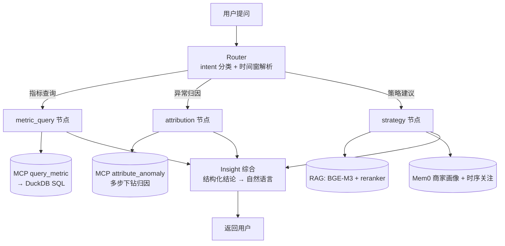

# MerchantCopilot

面向直播电商中小商家的经营分析 Agent。核心能力是**基于 Mem0 的商家画像记忆** —— 让每个商家得到锚定其画像与历史的个性化经营建议,而非通用 RAG 问答。LangGraph 多角色编排与 RAG 是载体,**Memory 是灵魂**:消融实验证明,关闭 Memory 后某些建议事实会**完全消失**(见下)。

> 演示/作品项目,使用固定随机种子的 mock 数据(虚拟商家「小张女装」,中端女装直播间),含 3 个植入的真实业务故障用于归因评测。

---

## 核心成果

两组 before→after 硬数字,均经校准的 LLM-as-judge + McNemar 检验。完整统计推导见 `evals/runs/`。

### 1. Memory 的不可替代价值(消融:full vs 关闭 Mem0)

在 50 条 strategy 查询上对比「开 Memory」与「关 Memory」(RAG 保留),CC 人工判画像锚定(binary 事实判):

| 度量 | 关 Memory | 开 Memory | McNemar χ²(连续校正) |
|---|---|---|---|
| **Mem0 独家聚合事实**(KB 不含的客群结构精确数字)| **0%** | **40%** | 20.0(18.05)✅ |
| 常驻画像锚定(价格带/客群/分时,任一作实质依据)| 66% | 82% | 8.0(6.12)✅ |
| 时序记忆锚定(追问引用前置对话,n=16)| 0/16 | 12/16 | 12.0(10.08)✅ |

**最硬的一条**:KB 与常识都给不了的画像精确事实,关闭 Memory 后锚定率严格归零(0%→40%)—— 不是「加了好一点」,是「关掉就完全消失的独家能力」。诚实边界:基础画像(价格带/客群)与商家专属 RAG 知识库**高度冗余**,Memory 的不可替代价值集中在 KB 之外的聚合事实与时序记忆(详见报告)。

### 2. Bad case 修复回归(metric_query 解析升级)

针对评测暴露的 10 条 bad case(group-by 分组查询 + 多段跨期对比),做 metric_query 解析升级(3 组件 additive 改动,不破坏现有行为):

- **通过率 before 0% → after 70%**(McNemar χ²=7.0,连续校正 5.14 > 3.841,**显著**)
- 全量回归测试 **16/16 PASS**(additive 设计:不传新参数时行为字节级不变)
- 剩余 3 条诚实归因:数据层 100% 修对(node_data 逐条核实 = 真值),瓶颈下移到下游 Insight 呈现层 → 记为 v2.0 优化项

> 支撑:系统接入真实数据 vs 裸 LLM(无工具)。judge 原样读数 26.7% vs 6.7%(χ²=3.6,**inconclusive 主读数**,如实报);人工核查发现裸 LLM 的 2 个「通过」是 judge 把其编造数字误判的**假阳**,纠正后 26.7% vs **0%**(χ²=8 显著,裸 LLM 无数据接入本就该 0%)。这条同时是 LLM-as-judge scope 边界的实证(见诚实边界 #1)。

---

## 架构



LangGraph `StateGraph`:Router 一次性路由到三类任务节点之一,各自跑完汇到 Insight。SQL 全部下沉 MCP Server(节点薄壳化);RAG 与 Mem0 仅 strategy 节点消费。

---

## 技术栈

| 层 | 选择 |
|---|---|
| Agent 编排 | LangGraph 1.2(StateGraph + 条件边)|
| 商家画像记忆 | Mem0 2.0(`infer=False` 确定性写入)|
| 检索 | BGE-M3 embedding + bge-reranker-v2-m3 两阶段(sentence-transformers)|
| 工具协议 | 官方 Python MCP SDK 1.27(stdio,2 个 tool)|
| LLM | DeepSeek-V3(被测 agent)/ Qwen-Max(评测 judge,跨家避免 self-eval)|
| OLAP | DuckDB 1.5 |
| 可观测 | LangSmith(`@traceable` 显式装饰)|
| Demo UI | Streamlit |

---

## 评测方法

- **数据集**:版本化 eval dataset 80 条,4 类查询(指标查询 12 / 异常归因 10 / 策略建议 50 / 跨期对比 8),分层覆盖难度 + 含 3 个植入业务故障。
- **LLM-as-judge**:用 Qwen-Max(**跨家于被测 DeepSeek-V3,避免 self-eval**);每条 3 次采样取众数压 LLM 固有方差。
- **校准**:binary 三类经 calibration 达 Krippendorff **α=0.856**(达标);strategy 连续值 Spearman 0.605 未达标 → **诚实降级**为参考值,不报显著性(LLM judge 在细粒度质量判断上的能力边界)。
- **消融**:三配置对比 full / 关 Mem0 / 裸 LLM,paired McNemar 检验。

详见 `evals/runs/ablation_6_3_report.md`、`stage6_4_results.md`、`calibration_sampling.md`。

---

## 诚实边界 / 已知局限

本项目刻意记录「什么没做到、为什么」,而非只报成功路径。代表性 3 条(均有详细留痕):

1. **LLM-as-judge 的 scope 边界**:judge 只在它被校准过的分布上可信。实测中 judge 把裸 LLM 凭空编造的数字误判为正确(假阳),因为 calibration 用的是真实系统输出、从未覆盖「裸 LLM 编造」这种分布。→ 量化结论经人工核查纠正后报告。(`ablation_6_3_report.md §2`)
2. **责任分层 / Insight 呈现瓶颈**:6.4 修复把 metric_query 数据层 100% 修对(中间产物逐条核实 = 真值),但端到端仍有 3 条 fail —— 根因是下游 Insight 节点的 LLM 把结构化数字编辑成叙事时丢值,属呈现层忠实度问题。记为 v2.0,不越界硬修(避免波及已验证的 strategy 叙事质量)。(`stage6_4_results.md §4-5`)
3. **Memory 锚定 vs 质量两维分离**:Memory 显著提升回答对商家画像的**锚定**(个性化),但策略建议的**质量**主要来自 RAG 知识库 —— 两个维度分开评测,锚定显著、质量提升 nil(过度确定),不混为一谈。(`ablation_6_3_report.md §1,3`)

> 调性:识别出边界并记录为后续优化项,不是「这里做得不好」。完整方法论沉淀见 `evals/runs/methodology_log.md`。

---

## 快速开始

```bash
# 1. 依赖
pip install -r requirements.txt

# 2. 配置 key(复制模板后填入 DeepSeek + Qwen API key)
cp .env.example .env
#   编辑 .env:DEEPSEEK_API_KEY=... / QWEN_API_KEY=...(judge 用)

# 3a. 命令行单次提问
python scripts/chat.py "2026-04-02 GMV 为什么暴跌"

# 3b. Streamlit demo
streamlit run ui/app.py

# 4.(可选)跑评测消融
python evals/run_ablation.py        # 三配置消融
python evals/judge_ablation.py      # judge 评分
```

首次运行会本地加载 BGE-M3 + reranker(strategy 路径用),稍慢;指标/归因路径不加载。

---

## 项目结构

```
app/agent/     # LangGraph 编排 + Router/metric/attribution/strategy/insight 节点
app/tools/     # MCP Server(query_metric / attribute_anomaly)
app/rag/       # BGE-M3 + reranker 两阶段检索
app/memory/    # Mem0 商家画像封装
evals/         # eval dataset + LLM-as-judge + 消融/回归报告 + 方法论 log
data/          # mock 数据生成 + DuckDB + 知识库 markdown
ui/            # Streamlit demo
docs/          # 各阶段总结 + 架构 + 演示话术
```

深挖建议:`evals/runs/`(评测报告 + 方法论沉淀)是本项目工程严谨度的主要载体。
