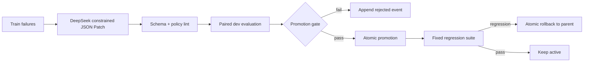

# MerchantCopilot v3 架构

## 设计目标

v3 把 Agent 的可学习状态拆成两类：Memory 保存“发生了什么、目前什么为真、决策后来怎样”；Skill 保存“某类任务应该按什么受限程序执行”。RAG 只提供通用知识，Tool 只提供原子、可核验的数据操作。四者不互相冒充。

```mermaid
flowchart LR
  Q["RunContext + Query"] --> M["Canonical Memory recall"]
  M --> D["Skill metadata discovery"]
  D --> S["Select then load full Skill"]
  S --> C["Compile bounded plan"]
  C --> T["Whitelisted tools"]
  T --> V["Evidence verifier"]
  V --> R["Structured decision + deterministic renderer"]
  R --> P["Typed Memory policy + canonical commit"]
  P --> E["Append-only run events"]
```

运行图仍受每 run 最多 3 actions、最多 1 次 replan、120 秒约束。`/v1` 路由和 SSE 词表不变；v3 字段全部在内部 state 或向后兼容的可选结果中。

## Memory：事实源与投影分离

`memory_events` 是 append-only 输入账本，`memory_facts` 是可查询的 current-state 投影，pgvector 是可重建索引。写入顺序固定为：

1. 校验 observation、user_fact、inference、decision、outcome 类型与证据。
2. append event，并以 `(run_id, source_ref)` 幂等。
3. 在语义键 advisory lock 下 materialize fact；时间范围重叠才 supersede。
4. outcome 校验其关联的 decision 已执行，再写 `decision_outcome` link。
5. 尝试向量索引；失败保留 `pending`，由补偿流程重试。

工具 observation/outcome 没有 evidence 会被拒绝；LLM inference 默认 pending；推断不能覆盖工具事实。thread scope 必须匹配当前 thread，merchant scope 才能跨 thread 复用。Recall 记录 recalled、injected、cited、used ID，回答中的数字、证据 ID、观察窗和阈值由确定性 renderer 输出。

## Skill：声明式程序而非代码生成

文件 bundle 用于 bootstrap 和 Git review；Postgres `skill_versions` 是运行时事实源。Runtime 先只发现 id/version/description/task types，选中后才加载完整 `SKILL.md` 和 `contract.yaml`。DSL 只允许已有 `metric`、`attribution`、`strategy` action，确定性 precondition/evidence operator，以及 `stop`/一次 `replan`。

编译器拒绝未知字段、非白名单工具、超过 3 步、非法引用和非法失败分支。每次 selection、compiled plan、tool result、evidence verdict、structured decision 均写入 run event。当前三个 Skill：

- `anomaly-root-cause`：先验证指标/基线，再分层 attribution。
- `cross-period-comparison`：统一窗口后计算绝对/相对/占比变化。
- `outcome-driven-experiment`：使用画像、Decision/Outcome 生成单变量实验及验收阈值。

## 离线演化与事务门禁

Patch 不得改变 Skill ID、allowed tools、执行上限、verifier、数据划分、晋升阈值或 Memory policy。test partition 在代码层禁止进入生成、选择、晋升或回滚。`generated/promoted/rejected/rolled_back` 只追加；active 切换和 event 同事务完成。运行中不即时自修改。

## 可重放 Harness

`run_events` 对 `(run_id, sequence_no)` 唯一，并通过事务 advisory lock 在并发下分配序号。`query_ingested`、每次模型 system/user/结构化输出、model-visible Memory、Skill 选择、计划、工具证据、决策和 final 可按序重建。API key 和原始思维链不入库。

## 关键边界

- 无数据库的普通 demo 可降级；正式 Memory/Skill 评测没有 Postgres 或 provider usage 时 fail-fast。
- Strategy 是受限 schema filling；正式路径使用 non-thinking，减少无收益的思维 token 与超时尾部。
- Skill metadata 当前使用确定性任务/词项匹配；BGE-M3 只共享给 RAG 与 Memory。
- Cloud Run、Supabase 和 Flutter 联调 deferred；本设计不声称生产 SLA。
